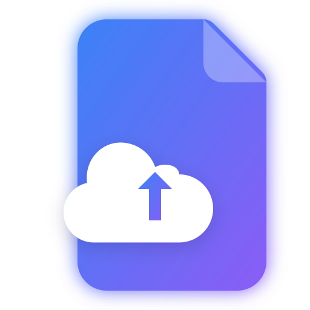
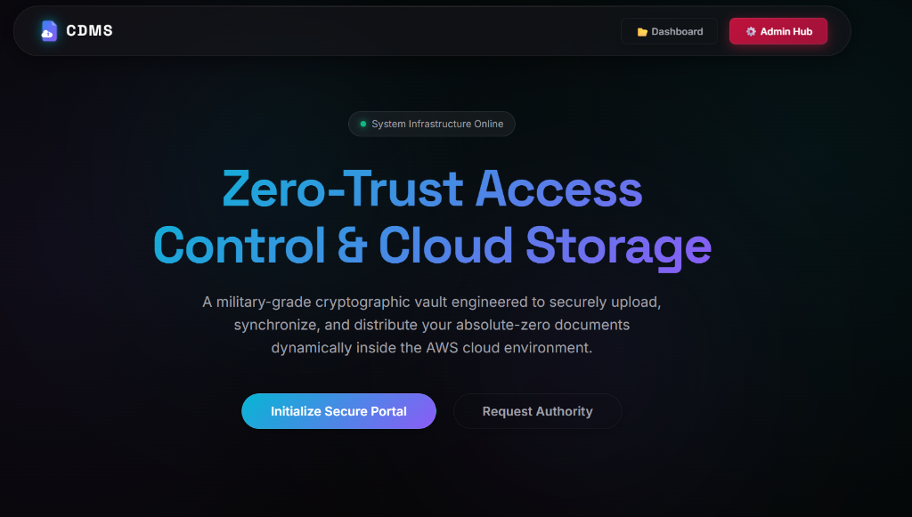
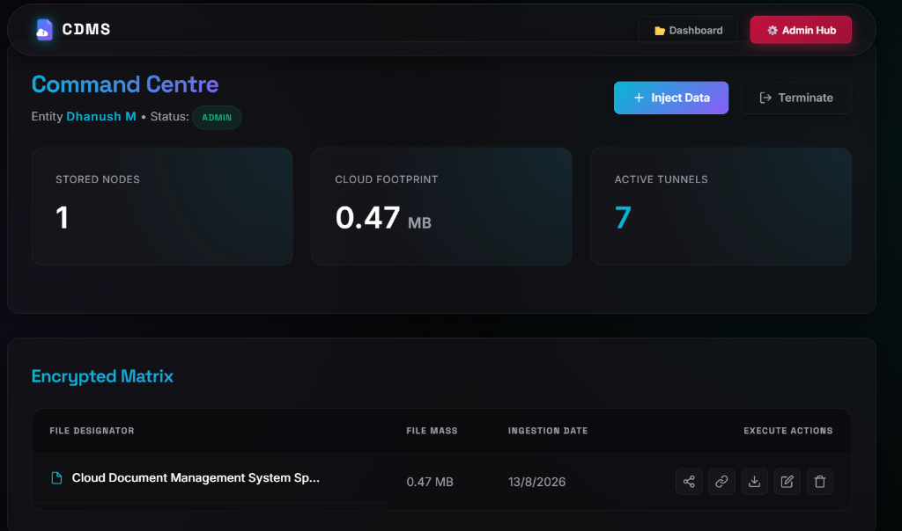
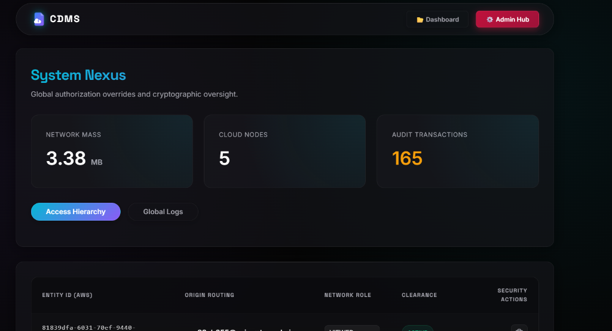
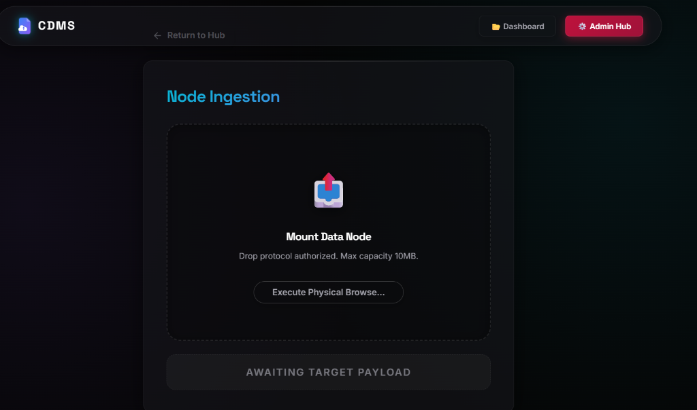
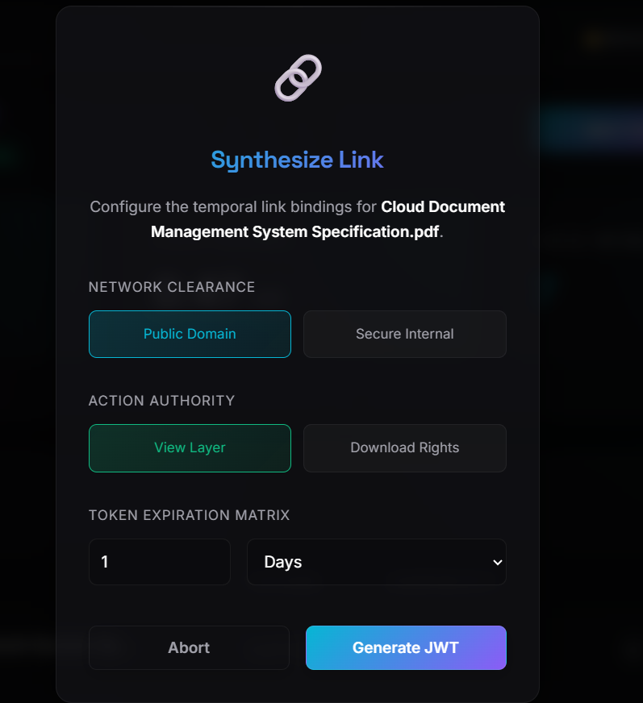
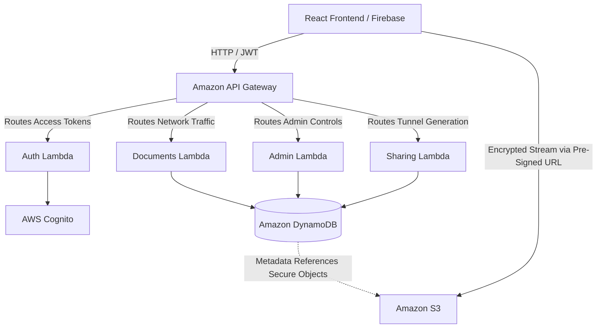
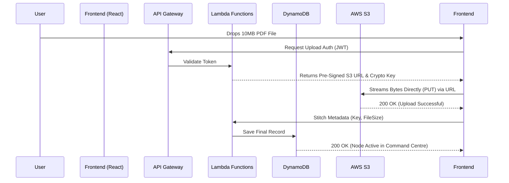

<div align="center">
  
  
  
  

  <br />
  <br />

  <h1>
     
    CDMS (Cloud Document Management System)
  </h1>
  
  <p>
    An enterprise-grade, highly secure cloud architecture designed to ingest, encrypt, and manage data nodes at scale.
  </p>
  
  <strong>[Live Production Environment](https://cdms16.web.app)</strong>
</div>

<hr />

## 📖 Table of Contents
- [📖 Table of Contents](#-table-of-contents)
- [🎯 Vision & Purpose (Why Use CDMS?)](#-vision--purpose-why-use-cdms)
- [🚀 Technologies Used](#-technologies-used)
- [🏗️ System Architecture & Diagram](#️-system-architecture--diagram)
- [🛡️ Security & Access Control (RBAC)](#️-security--access-control-rbac)
- [📖 How to Use the Portal](#-how-to-use-the-portal)
- [⚡ Quick Start Deployment](#-quick-start-deployment)

---

## 🎯 Vision & Purpose (Why Use CDMS?)

Standard cloud drives (like Google Drive or Dropbox) are designed for general productivity. **CDMS is built exclusively for enterprise security and traceability.** 

If you need to store highly sensitive documents, track every single interaction mathematically against an immutable block, and issue self-destructing links that prevent third parties from downloading your intellectual property—CDMS is the solution.

### Key Tenets:
1. **Zero-Trust Network**: Anyone can register, but *nobody* gets access until explicitly verified and authorized by a System Administrator. Registration defaults to a strictly `QUARANTINED` state.
2. **Infinite Severability**: Share a file with a client using a cryptographic link that automatically explodes in exactly 15 minutes.
3. **Pristine Accountability**: Every interaction on the server is cataloged in a decentralized Audit Log. (e.g., "User A downloaded File B at exactly 14:02 UTC").

---

## 📸 System Interfaces

<div align="center">
  
  <br/>
  
  
  <br/>
  
  
</div>

---

## 🚀 Technologies Used

CDMS completely detaches the Frontend application layer from the Backend storage matrix via massive scalable serverless architecture.

### **Frontend Matrix (Client-Side)**
* **React (Vite ⚡)**: Lightning-fast compilation and client-side rendering engine.
* **React Router DOM**: Client-side routing to handle secure portal transitions without page reloads.
* **Vanilla CSS (Glassmorphism)**: 100% custom, utility-based CSS architecture. We reject bloated standard UI libraries in favor of pure performance, utilizing deep-space neon vectoring, `backdrop-filter: blur(20px)`, and physics-based cubic-bezier micro-animations.
* **Firebase Hosting**: High-speed edge network distribution for global access.

### **Backend Infrastructure (AWS Serverless)**
* **AWS Cognito**: Identity Provider handling cryptographic JWT provisioning and IAM alignment.
* **AWS API Gateway**: The front door to the backend, enforcing Cognito Authorizers before routing packets.
* **AWS Lambda (Node.js)**: A mesh of isolated microservices (Auth, Documents, Sharing, Admin) guaranteeing code never runs continuously—it spins up purely on demand.
* **Amazon DynamoDB**: NoSQL ultra-fast data layers managing robust relational mapping for `Users`, `Documents`, `Shares`, and `AuditLogs` seamlessly.
* **Amazon S3**: Absolute secure block storage where physical bytes natively reside, restricted entirely from public access.

---

## 🏗️ System Architecture & Diagram

The platform utilizes loosely coupled microservices pushing a **Direct-to-S3 Offload Pattern**. 

### 1. High-Level AWS Architecture



### 2. The Ingestion Engine (Direct Stream Mechanism)

The backend never touches the mathematical byte-weight of your files, completely eradicating server memory bottlenecks.



By streaming directly to S3 via temporary cryptographic keys, we achieve infinite scaling capabilities without increasing backend RAM costs.

---

## 🛡️ Security & Access Control (RBAC)

The system supports strict Role-Based Access Control (RBAC):

| Action | `VIEWER` | `EDITOR` | `ADMIN` (System Nexus) |
| :--- | :---: | :---: | :---: |
| Authenticate / Login | ✅ | ✅ | ✅ |
| Download Files | ✅ | ✅ | ✅ |
| Ingest/Upload New Data | ❌ | ✅ | ✅ |
| Share Links (Temporal) | ❌ | ✅ | ✅ |
| Rename/Delete Files | ❌ | ✅ | ✅ |
| Approve/Quarantine Users | ❌ | ❌ | ✅ |
| View Network Operations (Audit) | ❌ | ❌ | ✅ |

---

## 📖 How to Use the Portal

### 1. Initializing Access
1. Visit the [Live Production URL](https://cdms16.web.app).
2. Click **Initialize Secure Portal** and register a new identity token (Email & Password).
3. Wait for the `ADMIN` entity to approve your routing credentials through the System Nexus.
4. Login using your authenticated credentials.

### 2. Operating the Command Centre
* **Upload Data**: Click `Inject Data` or use the Drag-and-Drop dropzone to stream a payload straight to AWS S3.
* **Manage Matrices**: Your active nodes are presented in a unified table. You can use the action vectors on the right side to Rename (`Pencil`), Download (`Arrow`), or Execute Force Purges (`Trash`).

### 3. Creating Temporal Share Links
1. Click the **Share Nodes (Create Link)** icon next to any document.
2. Select your `Network Clearance` (Public vs Internal).
3. Select your `Action Authority` (View vs Download). 
   - *Note: If View is selected, the recipient is locked into a rigid IFRAME sandbox that specifically halts native download overrides.*
4. Select strict `Token Expiration Matrices` (e.g., 2 Hours).
5. Generate the JWT-backed URL and physically pass it to the target entity. The link self-destructs precisely when the clock expires.

---

## ⚡ Quick Start Deployment

For security researchers or engineers wishing to run a local clone of the matrix:

```bash
# 1. Clone the repository natively
git clone https://github.com/your-org/CDMS.git

# 2. Enter backend matrix and sync dependencies
cd backend
npm install

# 3. Deploy Serverless architecture to your personal AWS Environment
# Requires valid AWS credentials configured on your terminal
serverless deploy

# 4. Extract generated API endpoints and enter frontend matrix
cd ../frontend
npm install

# 5. Inject endpoints into local environment bindings
# Create .env file:
# VITE_API_URL=https://[YOUR-API-GATEWAY].execute-api.[REGION].amazonaws.com/dev

# 6. Ignite the local development hub
npm run dev
```

> **Support Integrity:** This portal is strictly closed to the general public. Operational inquiries should be routed directly through the network administrator.
